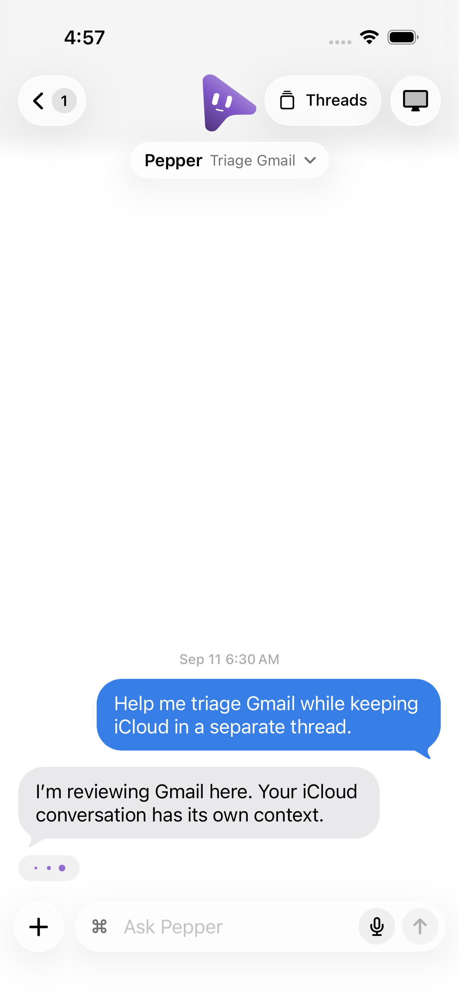
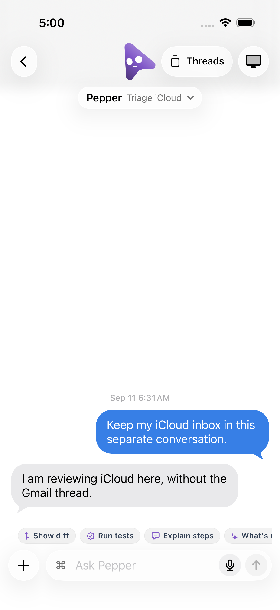

# iOS thread navigation

Use disposable simulators and synthetic data. Do not pair these checks with
the user's running desktop or mutate their conversations.

## Core and existing server contract

From `ios/`, run `swift test`. Thread navigation cases cover folder order,
search, legacy computers, orphaned folders, routine filtering, unread counts,
runtime projection and loading full history after a background SSE tail.

From the repository root:

```sh
pnpm exec vitest run server/paired-thread-targets-api.test.ts server/independent-threads-api.test.ts server/bot-projects-api.test.ts server/thread-capacity-api.test.ts
```

These server tests launch isolated fake-provider fixtures. They cover thread
ownership, simultaneous turns, thread-scoped stop/settings, paired requests,
folders and capacity. They do not drive the native iOS UI.

## Native UI

Generate the Xcode project with `cd ios && xcodegen generate`. Create a fresh
iPhone or iPad simulator, then run the `OpenMausCompanion` scheme's UI tests
against that explicit simulator ID. For example, from `ios/`:

```sh
xcodebuild -project OpenMausCompanion.xcodeproj -scheme OpenMausCompanion \
  -configuration Debug -destination 'platform=iOS Simulator,id=SIMULATOR_ID' \
  -derivedDataPath /tmp/omb-ios-threads-build CODE_SIGNING_ALLOWED=NO test
```

`ThreadNavigationUITests` launches with `-store-preview -threads-preview`.
`App/ThreadPreview.json` is a synthetic, offline UI fixture: Pepper has two
threads in Email, one unfiled thread, and one hidden routine run. No companion
client, tokens or provider process are started. This fixture is separate from
the captured server contract fixtures under `Tests/CompanionCoreTests/Fixtures`.
`App/ThreadPreviewPages.json` supplies offline sibling transcripts, so the
switching check can assert that the body as well as the title changes. The
bulk-delete UI checks add `-threads-preview-deletion` to update that synthetic
fleet in memory; `-threads-preview-deletion-fails-weekend` refuses the second
delete to check partial results. These flags are compiled only in Debug.

Check on iPhone and iPad:

1. Expand Pepper's Threads row and Email folder. Each visible thread opens
   directly; the routine run is absent. Check working, queued and unread labels.
2. Search by folder and thread name, then clear the search.
3. Enter an unsent draft in Gmail, switch to iCloud through the thread-name
   pill, and return. iCloud must not inherit Gmail's draft; Gmail must retain
   it. With the opening island animation enabled, use the separate Threads
   button in the top bar to open the same picker and switch again.
   Return to the roster and tap Pepper's main row: it must reopen the last
   selected thread. Terminate and relaunch the fixture app and repeat. An
   explicit sidebar thread link must still open that exact thread.
   `BotThreadSelectionTests` separately check durable storage, per-computer
   and per-bot isolation, deleted-thread fallback, and unchanged room behavior.
4. Open Updates. Active sibling threads must have distinct entries and titles.
5. In the thread picker, attempt creation while offline. The sheet must stay
   open and show an error. Failed renames must retain the entered title.
6. Select two idle threads for deletion, confirm the count, and check that the
   current working thread and its transcript remain. Repeat with the synthetic
   second-delete failure: only the first thread disappears and the remaining
   one stays selected with a visible partial-result error.

Keep the `.xcresult` bundle and screenshots as evidence. Shut down and remove
only the disposable simulators you created.
The PR's macOS CI runs `scripts/verify-ios-thread-navigation-ci.sh` after the
simulator build. It creates fresh iPhone and iPad simulators, runs only this
offline UI fixture, deletes those exact simulators, and uploads both `.xcresult`
bundles with screenshots as a short-lived artifact.

The offline UI checks do **not** prove real-device pairing, HTTPS/Tailscale,
live network reconnects, dictation or attachment uploads. Validate those with
the [iOS end-to-end runbook](../../ios/TESTING.md) against an isolated companion
before claiming them tested. No new server routes or pairing changes are
introduced by the thread UI.

## Recorded local pass — 2026-09-11

- Xcode 26.6 Debug simulator build succeeded.
- 383 CompanionCore tests and 17 isolated server integration tests passed.
- All five native UI cases passed on iPhone 17 Pro and iPad Pro 13-inch (M5),
  using disposable iOS 26.5 simulators. Search also preserves the previously
  expanded bot when it is cancelled.
- Retained results: `/tmp/omb-ios-threads-iphone-acceptance.xcresult` and
  `/tmp/omb-ios-threads-ipad-clean.xcresult`, including screenshots.
- No physical-device, live pairing or provider verification was performed.

## Last opened thread regression — 2026-09-20 UTC (2026-09-21 IST)

Choosing iCloud, returning to the roster, and tapping Pepper used to reopen
Gmail. The new regression failed against the original implementation, then
passed after persisting the phone's choice. It also terminates and relaunches
the fixture app before checking the bot row again.

- 465 Swift core tests passed, including persisted selection, connection/bot
  isolation, deleted-thread fallback, and unchanged room selection.
- All 9 thread-navigation UI cases passed on a disposable iPhone 17 Pro;
  relaunch persistence and explicit thread navigation also passed on a
  disposable iPad Pro 13-inch (M5), both using iOS 26.5.
- Local evidence: `/tmp/moca229-ios-red.xcresult`,
  `/tmp/moca229-ios-green.xcresult`, and `/tmp/moca229-ipad.xcresult`.

| Reopening Pepper before the fix | Reopening Pepper after choosing iCloud |
| --- | --- |
|  |  |
