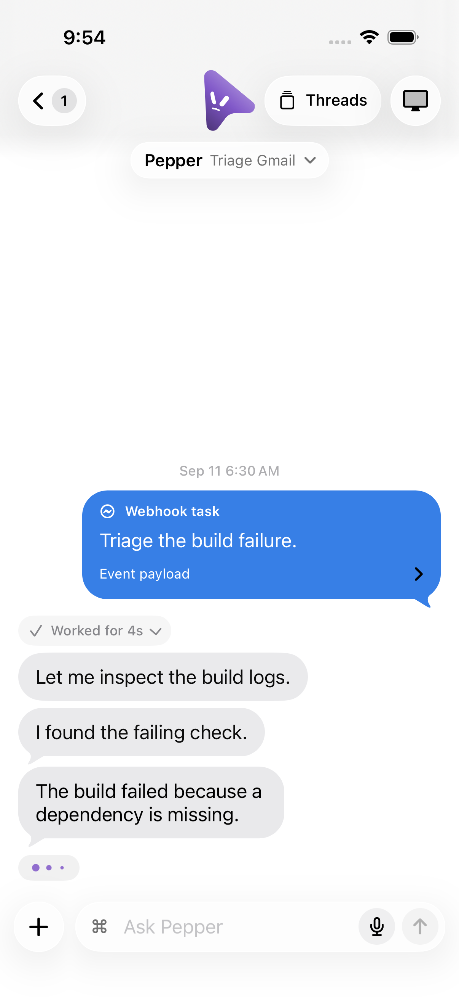

# iOS transcript presentation

Run the core checks with `cd ios && swift test`. `TranscriptPresentationTests`
exercises wire decoding, completed-turn folding at each activity level, live
terminal patches, legacy and unfinished replies, and webhook parsing. Stored
webhook prompts retain their model-facing trust boundaries.

For the native UI, generate the project with `xcodegen generate` inside `ios/`,
create a disposable iOS simulator, then run:

```sh
xcodebuild -project OpenMausCompanion.xcodeproj -scheme OpenMausCompanion \
  -destination "platform=iOS Simulator,id=$SIMULATOR_ID" \
  -resultBundlePath /tmp/omb-ios-transcript.xcresult \
  -parallel-testing-enabled NO \
  -only-testing:OpenMausCompanionUITests/TranscriptPresentationUITests \
  CODE_SIGNING_ALLOWED=NO test
```

The tests launch `-store-preview -chat-presentation-preview`, using
`App/ChatPresentationPreview.json` without an API client or paired computer.
`-chat-reasoning-preview` adds the runtime frame in
`App/ChatReasoningPreview.json`. These launch flags are Debug-only.

Check that completed narration starts inside a “Worked for 4s” fold and can
be expanded and collapsed while the final answer stays visible. Webhooks
show the task without envelope metadata; their payload opens on demand.
Hidden activity suppresses live reasoning while retaining the working
indicator, and Full keeps the reasoning control available. The tests attach
screenshots of the collapsed transcript and expanded webhook payload.

The existing `scripts/verify-ios-thread-navigation-ci.sh` also runs this suite
on disposable iPhone and iPad simulators. Keep the result bundles, then shut
down and delete only the simulator IDs created for verification.

These checks prove native presentation with synthetic data. They do not
exercise a physical iPhone, pairing, or actual webhook delivery.

## Local evidence — 2026-09-18

- Before the fix, the new core regressions failed on unfolded narration and
  raw webhook previews. After the fix, all 465 core tests passed.
- All three UI cases passed on a disposable iPhone 17 Pro / iOS 26.5 simulator,
  including expansion and collapse, Hidden reasoning, and Full reasoning.
- Result bundle: `/tmp/omb-chat-presentation-ui.xcresult`. Exported screenshots
  in `/tmp/omb-chat-presentation-screenshots/` were visually inspected.
- The disposable simulator was shut down and deleted. No user data was used.

## Review regressions — 2026-09-18

- Task markers inside untrusted webhook data cannot override the configured or
  default task. Missing, blank and malformed trusted prefixes keep the raw
  message. The regression failed before the change in Swift, Kotlin and the
  desktop parser; all three pass after the fix.
- All 466 Swift core tests and all three simulator presentation tests passed.
  Expanded narration now tails only its last bubble. The expansion case was
  rerun to capture the screenshot below.
- Evidence: `/tmp/moca204-review-ui.xcresult`,
  `/tmp/moca204-expanded-ui.xcresult`, and
  `/tmp/moca204-expanded-screenshots/`. The disposable simulator was deleted.
- The desktop renderer suite passed all 1,792 tests, including its parser
  regression. This is not a claim that the entire server/desktop suite passed.


