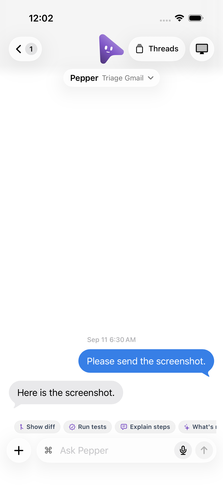
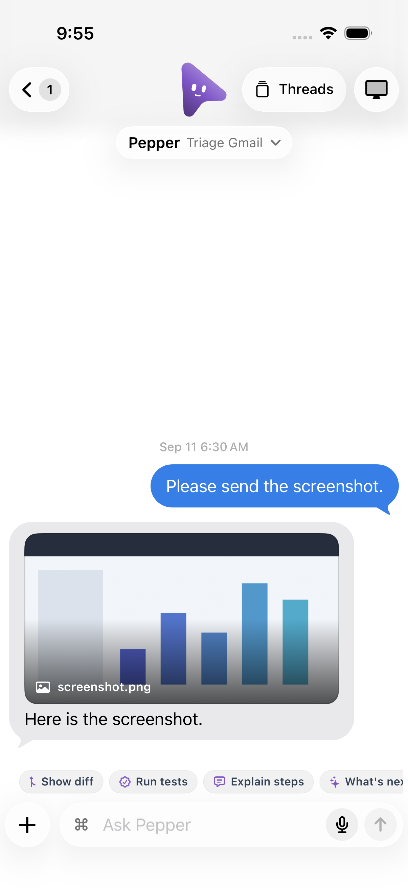
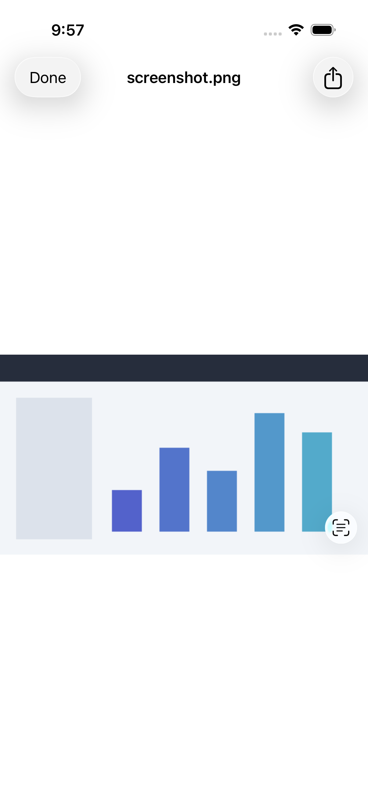

# Agent image attachments on mobile (MOCA-212)

The server puts engine-generated images in `Message.attachments`, including
late patches onto a text reply and replies with no text. Both native clients
previously discarded this wire field. Desktop rendered it, but the mobile chat
showed only the accompanying sentence (or an empty bubble).

The native models now preserve that field and the text bubbles display its
image entries using the existing authenticated attachment previews. Unknown
attachment kinds remain decodable, duplicate paths render once, and old text
messages still work. Image placeholders, labels, and errors use the appropriate
foreground color for the message. iOS keeps image view identity by path.

The message file endpoint now accepts the exact generated image listed on the
stored bot message. This grant is restricted to the private attachment directory
and image files; it does not grant arbitrary workspace reads. Existing Markdown
and user-upload authorization still applies to their respective requests.

**Compatibility:** this fix needs the updated native client and server. An older
server rejects the new message-scoped generated-image request. This verification
covers structured `Message.attachments`, not arbitrary Markdown image syntax,
remote image URLs, or a specific reporter's provider/device (none was supplied).

## Isolation and regressions

No paired computer, live account, or user conversation was used.

- Swift and Kotlin wire/cache round-trip regressions both failed before the model
  change (the image path disappeared) and passed afterward.
- Native core regressions cover legacy text, image-only replies, future attachment
  kinds, duplicate paths, and late message patches.
- Android `GeneratedImageWiringTest` mounts the real message row and Session with
  disposable MockWebServers. The tests cover a late patch, an image-only reply,
  dark/light surfaces, failed-download retry, preview callback bytes and the
  originating message, plus the POST path/body and bearer. All sockets are closed.
- iOS `GeneratedImageUITests` runs in a disposable iPhone 17 Pro simulator. The
  explicit `-images-preview` flag uses a bundled synthetic fleet and PNG. Its
  URLProtocol intercepts all traffic and only returns the PNG for the exact
  message-scoped POST, synthetic bearer, and file path. The same test fails with
  the original renderer and passes with the image row, then waits for the full-screen image canvas and closes the preview.
- Real HTTP regressions in `server/index.test.ts` use its disposable home/server.
  They reproduce the prior 403 for an image-only attachment, prove image download,
  and reject another message/path, a path outside the private attachment directory,
  and a non-image file. The targeted run also checks existing file/image previews.

The iOS protocol fixture and Android HTTP stubs test the native request and UI;
the separate real-server tests test server authorization. They do not constitute
a physical phone connected end to end to a released desktop build.

## Commands and evidence

From the repository root, with Node 24, Android SDK and the repository's JDK setup:

```sh
swift test --package-path ios
android/gradlew -p android :core:test :app:testDebugUnitTest :app:assemblePreview --max-workers=2
pnpm exec vitest run server/index.test.ts -t 'structured generated image|downloads only a file|downloads an image|streams an authorized|shared in a user|user attachment|preview'
pnpm typecheck
pnpm test
```

Native results: **462 Swift core tests; 544 Android core + 916 Android app tests**.
The Android preview APK builds and passes APK v2 signature verification. The
focused real-server run passes **10 tests** (220 unrelated tests filtered out).

Repository-wide run on 2026-09-19: **7,351 passed, 1 failed, 60 skipped,
1 todo** across 586 Vitest files (569 passed, 1 failed, 16 skipped). The only
failure is the existing delegate replay assertion at
`server/delta-context.e2e.test.ts:963`, previously reproduced against pristine
main `0c327bca` during the mobile queue investigation. It is unrelated to these
attachment changes. `pnpm test` therefore exits nonzero before its chained
checks; running those separately passes **9 broker tests**, **347 Electron tests
(3 skipped)**, and the packaged-server smoke. Typecheck, lint, and locale
validation pass. The full suite is not claimed green.

Generate the Xcode project with `xcodegen generate --spec ios/project.yml`.
Create a fresh simulator, then run:

```sh
xcodebuild -project ios/OpenMausCompanion.xcodeproj \
  -scheme OpenMausCompanion \
  -destination 'platform=iOS Simulator,id=YOUR_DISPOSABLE_SIMULATOR_ID' \
  -resultBundlePath /tmp/mobile-images.xcresult \
  -parallel-testing-enabled NO \
  -only-testing:OpenMausCompanionUITests/GeneratedImageUITests \
  CODE_SIGNING_ALLOWED=NO test
```

Shut down and delete only that simulator afterward. No signing or release is
performed. The preview protocol and fleet selection are compiled only in DEBUG.

| Before | After |
| --- | --- |
|  |  |


