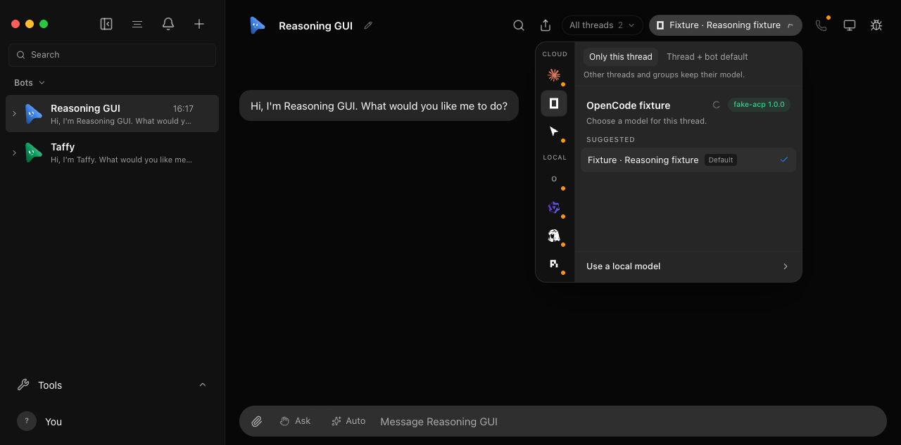
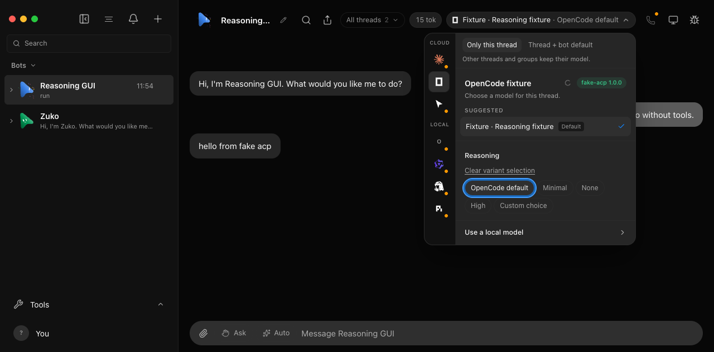
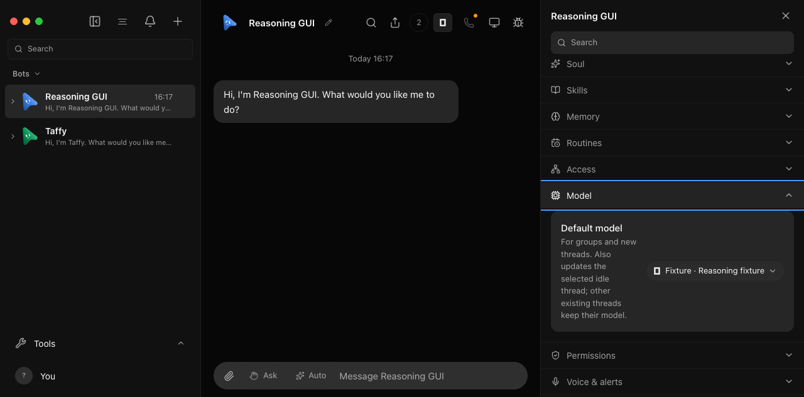
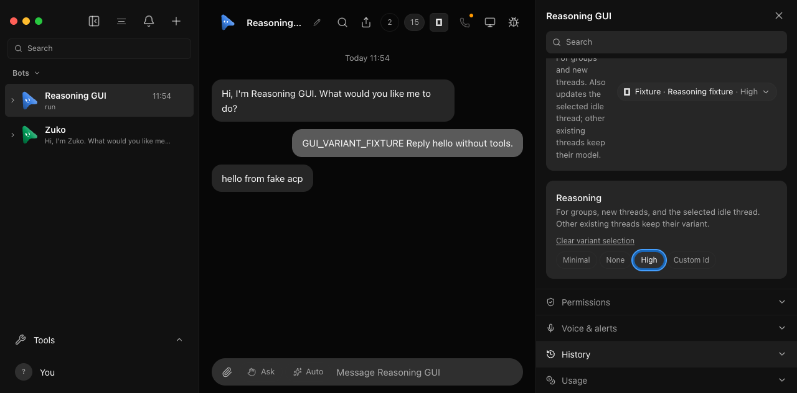

# OpenCode reasoning choices

The optional functional test launches the real OpenMausBot server, its OpenCode
ACP driver, an explicitly supplied OpenCode binary, and an owned loopback
Responses endpoint. All homes, configs, models, conversations and credentials
are disposable. The test never discovers a CLI from the user's PATH or sends a
prompt to a real model provider.

Supply an absolute path to an independently verified OpenCode 1.18.31 binary:

```sh
OMB_OPENCODE_E2E_CLI=/absolute/path/to/opencode pnpm exec vitest run server/opencode-variants.e2e.test.ts
```

Without `OMB_OPENCODE_E2E_CLI`, Vitest reports this test as skipped. A skip does
not verify the feature. The test performs no dependency installation or binary
download. OpenCode 1.18.31 is required because this recipe exercises its ACP
`default` effort option, which removes the explicit session variant override.
Model, agent or provider configuration can still supply an inherited reasoning
value. Omission at the HTTP boundary is proved here only for this synthetic
fixture, which has no inherited effort options.

The synthetic model advertises `minimal`, `low`, `medium`, `high` and `xhigh`.
The checks require OpenMausBot to retain this catalog metadata, advertise its
variant capability, save different choices for two conversations on one bot,
and forward each choice through its actual runtime and ACP driver. One
conversation uses `low`; its sibling explicitly uses `default`. In this fixture, captured HTTP
requests must contain `reasoning.effort: "low"` for the first and omit the
effort for the second. The provider encodes the received effort in its reply,
and the test checks the conversation's final answer so an auxiliary native
request cannot satisfy the main-turn assertion. Both conversations are sent again after restarting the
OpenMausBot server with the same disposable data directory.

Evidence is written alongside the retained server log as
`*.opencode-variants.json`. It records control actions, asserted selections,
and sanitized request receipts: synthetic marker, model, endpoint and effort.
It does not retain full provider request bodies, authorization headers or MCP
tokens. The fixture closes its own children and loopback server, then removes
its disposable home. The log and evidence paths are printed by the test.

This proves API persistence and actual OMB → ACP → OpenCode → SDK transport
against a simulated provider. It does not establish acceptance by any real
provider, an upstream gateway's routing, or the OpenMausBot GUI. The fixture
rejects `none` at its simulated provider as a guard; real model capabilities
must still govern whether `none` is a valid choice. Renderer accessibility,
profile and conversation selectors, stale response isolation, and the absence
of effects on sibling conversations must also be checked with the isolated
[chat UI workflow](chat-ui.md) before claiming the GUI is verified.

## An unavailable engine returns without variant support

```sh
pnpm exec vitest run server/model-variant-return.e2e.test.ts
```

This permanent, non-opt-in regression uses the shared fake-Claude launcher.
It saves a variant through the HTTP API while the selected instance is
unavailable, stops its owned server, adds a synthetic returning instance with
no variant support, and restarts the same disposable data directory.

The direct conversation must reject the next turn with HTTP 409. A group
selecting that bot must record an actionable failed activity. Neither path
may start the fake provider prompt. The retained
`*.model-variant-return.json` contains the refusal and group activity. This
checks the actual dispatch guards, not only the shared validation helper.

## Renderer verification

The real renderer was exercised against a disposable server and scripted ACP
engine. Selecting `minimal`, supported `none`, clearing the selection, and
selecting session-advertised `default` persisted only on the chosen thread.
A reload kept the saved `default` without falsely declaring it unavailable.
The profile control preserved the existing profile behavior: update the bot
default and selected idle thread, while leaving its sibling thread unchanged.
No browser console errors were observed.

The before screenshots use upstream `82d277ae`; all names and model data are
synthetic. These images establish renderer behavior, not provider acceptance.

| Control | Before | After |
| --- | --- | --- |
| Conversation |  |  |
| Profile |  |  |
